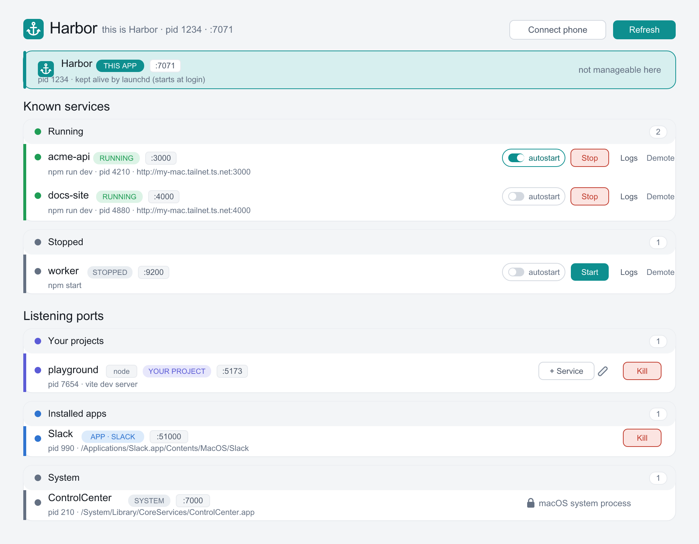

# ⚓ Harbor — a local port manager for macOS

Harbor lists everything listening on a TCP port, lets you start/stop a saved set of
"known services," kill rogue processes, and hands you copyable Tailscale links so you can
open any dev server from your phone. One Node process, no database, no cloud.

> **macOS only.** Harbor relies on macOS-specific tools (`lsof`, POSIX process groups, launchd,
> Touch ID). Windows isn't supported.

<p align="center">
  
  <br><em>Illustrative UI with sample data.</em>
</p>

## What it does

- **Lists TCP listeners** (`lsof` + `ps`) with process name, PID, port(s), and the full launch command.
- **Kill** any process you own, with a **force `kill -9`** step that only fires after you confirm.
- **Known services** defined in [`services.json`](services.json): Start ones that are stopped,
  Stop ones that are running, and flip **autostart** per service from the UI. Matched to live
  processes **by port**.
- **Readable names**: each listener is labelled by its project (from its working directory /
  `package.json` name), so five `node` servers read as `jumpr-local`, `my-api`, … not all "node".
- **Typed by origin**: every listening port is classified — **your project**, an **installed app**
  (with its name, e.g. Raycast/Grain), a **macOS system** process, a **CLI tool**, or an
  **unrecognized** process — grouped into **collapsible sections** so you can fold away the noise.
- **Rename & describe**: give any port a custom name + description (the ✎ button). Keyed by the
  project's folder, so it sticks across restarts and port changes.
- **Promote to service** (the **+ Service** button): turn a detected project into a managed service
  — Harbor pre-fills its folder, port, and a suggested start command (from `package.json`). Once
  saved it gets Start / Stop / autostart, and shows **needs restart** if it later goes down.
- **Survive & re-adopt**: services Harbor starts keep running if Harbor restarts/crashes, and get
  re-attached on the next launch.
- **Tailscale links**: per-port `http://<machine>.<tailnet>.ts.net:<port>` you can copy in one click,
  and Harbor's own UI is reachable from your phone (token-protected).
- **Touch ID** (optional): gate destructive actions on this Mac behind Touch ID.
- Colour code — services: **green** = running · **gray** = stopped. Ports by type:
  **green** = known service · **indigo** = your project · **blue** = installed app ·
  **gray** = system/tool · **yellow** = unrecognized. Protected processes show a 🔒 and can't be killed.

## Get started

**macOS only.** You need [Node.js](https://nodejs.org) ≥ 18 — check with `node -v`. Nothing else is
required (no database, no API keys, no accounts).

### Option A — Terminal

```bash
git clone https://github.com/terrichan-git/harbor.git
cd harbor
npm install
npm start
```

Open **http://localhost:7071**. On your own Mac the UI needs no token — that's it.

### Option B — with Claude Code

Let [Claude Code](https://claude.com/claude-code) set it up for you:

```bash
git clone https://github.com/terrichan-git/harbor.git
cd harbor
claude
```

Then tell it: **“install dependencies and start Harbor, then open it in the browser.”** It will run
`npm install`, launch on port 7071, and can verify the page loads. (You can also just run `/run`.)

### Then, optionally

- **Start at login** so Harbor is always there: `npm run install-login` (removes with
  `npm run uninstall-login`).
- **Reach it from your phone:** install [Tailscale](https://tailscale.com) on your Mac and phone,
  sign in to the same account on both, and turn on **MagicDNS**. Then on your Mac click
  **📱 Connect phone** and scan the QR. Harbor works fully without Tailscale — the remote/copy-link
  features just stay hidden.

> **Port.** Harbor defaults to **7071** (7070 is commonly taken by other dev servers). Run on a
> different port any time:
> ```bash
> HARBOR_PORT=8090 npm start
> ```

### Define your services

`services.json` is **your local machine state** (git-ignored, may contain absolute paths); Harbor
seeds it from [`services.example.json`](services.example.json) on first run. Add services three ways:
promote a detected project with **+ Service**, hand-edit `services.json`, or copy the example.
Remove one with the 🗑 button (deletes the definition only — never stops the process).

Each entry:

```json
{ "name": "api", "cwd": "~/projects/my-api", "command": "npm run dev", "port": 8080, "autostart": false }
```

- `port` may be a single number or an array (`[4000, 4001]`) for multi-port services.
- `autostart: true` starts the service when Harbor launches at login (default `false`). You can
  flip this from the UI with the **autostart** toggle on each service — it writes `services.json`
  for you (and reformats it to canonical JSON).
- `cwd` may use `~`. The command runs through your shell in that directory.

Hit **Refresh** (or the list auto-refreshes every 4s) to pick up changes.

## Reach it from your phone (Tailscale)

With Tailscale up, Harbor prints a tokenized URL on startup:

```
http://<your-machine>.<tailnet>.ts.net:7071/?token=<token>
```

Easiest: on your Mac open http://localhost:7071 and click **📱 Connect phone** — scan the QR with
your phone's camera. It opens Harbor and stores the token in `localStorage`, so it stays connected
across restarts (connect once). The QR endpoint is loopback-only, so the token is never served over
the tailnet. Alternatively, open the printed `…/?token=…` URL on the phone directly. The token lives
in `data/token` (git-ignored, `chmod 600`) and is required for every state-changing request.

## Touch ID (optional, this Mac only)

Open Harbor via **http://localhost:7071** (the hostname `localhost`, not `127.0.0.1`) and click
**Set up Touch ID**. After enrolling, Kill/Stop from this Mac require a fingerprint. It never
replaces the token — the phone still uses the token. (WebAuthn needs the `localhost` hostname; see
HANDOFF.md for why.)

## Launch at login

```bash
npm run install-login     # installs a LaunchAgent: starts at login, relaunches if it crashes
npm run uninstall-login   # removes it (services it started keep running)
```

Logs from the login-launched process go to `data/harbor.out.log`.

## Run it

```bash
npm start            # foreground on :7071 (or HARBOR_PORT)
npm test             # unit tests for the deterministic core
```

## How it's built

```
server/server.js        Express: serves the frontend + JSON API, binds 0.0.0.0
server/lib/             one home per concern — ports, services, processes, registry,
                        safety, tailscale, auth, webauthn
server/public/          static frontend (no build step)
scripts/                launch-at-login + icon generator
test/                   node --test suite
services.json           your known-services config (committed; edit freely)
data/                   runtime state — token, PID files, logs (git-ignored, NOT source)
```

See **HANDOFF.md** for architecture, the trap list, and the security model.

## Safety notes

- Harbor never kills its own process, PID 0/1, Apple system binaries (`/System`, `/usr/libexec`, …),
  or anything you don't own.
- `kill -9` always requires an explicit confirmation.
- Bound to `0.0.0.0` so the tailnet can reach it — which is why the token is mandatory. Keep your
  tailnet private (don't use `tailscale funnel`).
